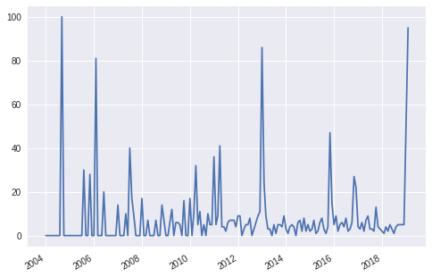

# Introdução

2019 vem tem sido um ano bem complicado para os brasileiros, diversas trágedias consecutivas neste inicio de ano nos trouxeram a imagem que 2019 será um ano complicado.

Curioso para saber se a quantidade e dimensão das tragédias são realmente maiores ou são eventos que estão mais dentro da minha bolha, decidi realizar uma avaliação do histórico de trágedias que nós brasileiros sofremos.

Para isso, utilizei os dados do google analytics, na categoria de notícias coletando os scores pela pesquisa "tragédia", é uma pesquisa muito superficial, só para nos dar uma visão de quais tragédias mais repercutiram na internet, já adianto que tive algumas surpresas e não concordo com muitos pontos da conclusão.


```

```

# Desenvolvimento


```
import matplotlib.pyplot as plt
import pandas as pd
from datetime import datetime
plt.close('all')
```


```
url = 'https://raw.githubusercontent.com/ZehLuckmann/TragediaAnalitycs/master/all_time_score.csv'
headers = ['Datetime','Percent']
scores = pd.read_csv(url, delimiter=",",names=headers, skiprows=[0])
```


```
scores['Datetime'] = scores['Datetime'].map(lambda x: datetime.strptime(str(x), '%Y-%m'))
x = scores['Datetime']
y = scores['Percent']

plt.plot(x,y)
plt.gcf().autofmt_xdate()
plt.show()
```





```
score_median = scores["Percent"].median()*10
print(score_median)
```

    40.0
    


```
datas_tragicas = scores.query('Percent>'+str(score_median))
print(datas_tragicas)
```

          Datetime  Percent
    8   2004-09-01      100
    25  2006-02-01       81
    87  2011-04-01       41
    108 2013-01-01       86
    142 2015-11-01       47
    180 2019-01-01       49
    181 2019-02-01       95
    

# Eventos mais marcantes por mês

*   09/2004 
    - No Paraguai o dono de supermercado tranca o estabelecimento durante incêndio para pessoas não sairem sem pagar, 400 pessoas mortas

*   02/2006 
    - Fãs pisoteados no show do RBD

*   04/2011 
      - Tragédia na Região Serrana do RJ deixa mais de 500 mortos
      - Massacre de Realengo mata 12 adolescentes e crianças e deixa 20 em estado grave.
 
*   01/2013
      -  Incêndio em boate mata 242 pessoas em Santa Maria

*   11/2015
      -  Rompimento de barragens em Bento Rodrigues em Mariana, Minas Gerais
  
*   01/2019
      -  Rompimento de barragens em Brumadinho

*   02/2019
      -  Incêndio no CT do Flamengo, mata 10 jovens

# Conclusão

Podemos notar que 2019 gerou uma anomalia maior que os outros anos, ele já apresenta dois meses na lista de maiores tragédias, pela analise superficial realizada, nenhum outro ano atingiu esse feito

Existem alguns eventos que me surpreenderam não aparecer nessa lista, o principal deles é o acidente com o avião da Chapecoense. Ele até gera uma anomalia, mas menor das apresentadas acima.

Vale resaltar que os dados analisados são relacionados ao Brasil, por isso muitos desastres naturais como Terremotos, Furacões que devastaram muitos países, acabam não sendo relacionados.
